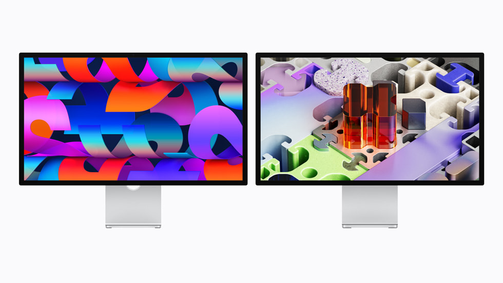

# 🖥️ Display Face ID

> **Status:** 💎 Conceito High-End & Sustentável
>
> Um display premium projetado para redefinir a interação entre o usuário e a tecnologia, combinando biometria avançada (Face ID) para detecção de atenção com uma infraestrutura robusta de Big Data para eficiência energética e inteligência de uso.

---

https://github.com/user-attachments/assets/38a2d646-5e93-45b2-8bc0-56cb4ced21b1

## 💎 O Produto: Display Face ID
O **Display Face ID** não é apenas um monitor; é o centro da sua estação de trabalho inteligente. Com sensores de profundidade e infravermelho integrados na borda superior, ele utiliza redes neurais profundas para reconhecer instantaneamente o usuário e, mais importante, o seu **nível de atenção**.
O design foi pensado para ser minimalista e funcional, sem comprometer a potência visual.

### 🚀 Funcionalidades Inteligentes:
* **Attention Detection:** O display detecta quando o usuário desvia o olhar ou dorme, iniciando modos de economia de energia gradativos em milissegundos.
* **Auto-Lock:** Bloqueio automático ao detectar a ausência da face cadastrada, garantindo segurança de dados.
* **Handoff Biométrico:** Login instantâneo em múltiplos serviços via Face ID ao se sentar à mesa.
* Veja abaixo o detalhamento da engenharia e das camadas do sensor Face ID integrado:

## 📊 Coleta e Inteligência de Big Data
Como detentores da tecnologia, nossa vantagem competitiva reside na estruturação de um ecossistema de dados privados (Big Data) provenientes de milhares de unidades ativas:

* **Métricas de Foco (Deep Insights):** Coleta de dados anônimos sobre padrões de atenção e fadiga ao longo da jornada de trabalho.
* **Telemetria Energética Global:** Monitoramento em tempo real do kWh economizado pelo nosso algoritmo de desligamento baseado em atenção.
* **Machine Learning Ops:** Uso dos dados coletados para refinar continuamente o modelo de IA que detecta o sono e a atenção.

### 🛠️ Minha Stack de Big Data (Proprietária)
* **Infrastrutura de Ingestão:** Pipelines de alta velocidade para telemetria IoT.
* **Data Lake & Processamento:** Apache Spark & Hadoop para análise de volumes massivos de logs de eventos de atenção.
* **BI & Visualização:** Dashboards executivos customizados para monitoramento de KPIs de produto e eficiência.

https://github.com/user-attachments/assets/f39fcaf1-8c99-4267-802c-c42fdd44ced9

---

## 🌍 Projetado pensando no planeta
O **Display Face ID** foi desenvolvido com um compromisso profundo com a sustentabilidade e a redução do impacto ambiental.

* **Material:** A base é feita com alumínio 100% reciclado.
* **Tecnologia Verde:** A tela de vidro padrão contém 80% de vidro reciclado, um marco para a nossa engenharia de materiais.
* **Ciclo de Vida:** A caixa 100% composta por fibras foi redesenhada para ser facilmente desmontada, permitindo sua divisão em pedaços menores que cabem na maioria das lixeiras de reciclagem domésticas.

---

## ✒️ Autor
* **Felipe Barbosa** - (https://github.com/fmzfelipe)
